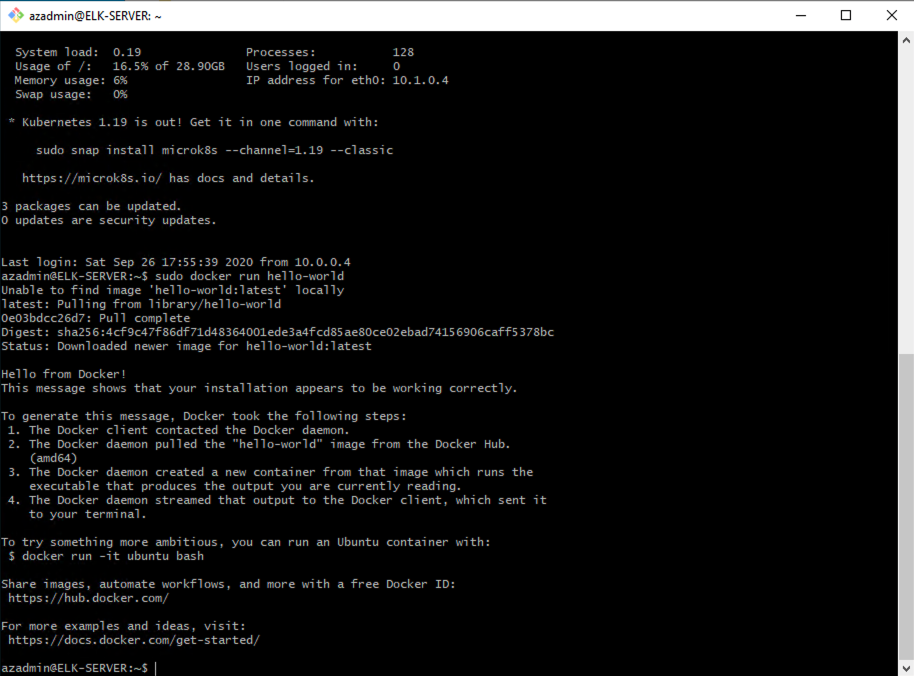

## Automated ELK Stack Deployment

The files in this repository were used to configure the network depicted below.


These files have been tested and used to generate a live ELK deployment on Azure. They can be used to either recreate the entire deployment pictured above. Alternatively, select portions of the playbook file may be used to install only certain pieces of it, such as Filebeat.

This document contains the following details:
- Description of the Topology
- Access Policies
- ELK Configuration
  - Beats in Use
  - Machines Being Monitored
- How to Use the Ansible Build


### Description of the Topology

The main purpose of this network is to expose a load-balanced and monitored instance of DVWA, the D*mn Vulnerable Web Application.

Load balancing ensures that the application will be highly **available**, in addition to restricting **inbound access** to the network.

The central idea behind using jump boxes is that they are highly-secured computers that are never used for non-administrative tasks. Given that the vast majority of computer security risks comes from administrators using the same computers for performing high-risk activities (e.g.,email, internet browsing, etc.), this allows admins a secure computer to first connect to before launching any administrative task.

Integrating an ELK server allows users to easily monitor the vulnerable VMs for changes to the server and system files.

Filebeat is a log shipper that you can install on your sever to monitor log files or any text files for important events. You can send relevant items to Elasticsearch or Logstash for indexing when you have a number of servers, virtual machines, and containers that generate logs.

Metricbeat is a shipper that you can install on your servers to periodically collect metrics from the operating system and from services running and ships them to a specified output destination.


The configuration details of each machine may be found below.

| Name        | Function   | IP Address | Operating System |
|-------------|------------|------------|------------------|
| Jump Box    | Gateway    | 10.0.0.4   | Linux            |
| Web-1       | Web Server | 10.0.0.5   | Linux            |
| Web-2       | Web Server | 10.0.0.6   | Linux            |
| Web-3       | Web Server | 10.0.0.7   | Linux            |
| ELK-SERVER  | Monitoring | 10.1.0.4   | Linux            |

### Access Policies

The machines on the internal network are not exposed to the public Internet.

Only the Jump Box machine can accept connections from the Internet. Access to this machine is only allowed from the following IP addresses:

`Workstation IP 52.177.85.216`

Machines within the network can only be accessed by a specified public IP address and Jump Box.

`Jump Box IP: 10.0.0.4 & home IP via SSH 52.177.85.216`

A summary of the access policies in place can be found in the table below.

| Name        | Publicly Accessible | Allowed IP Addresses |
|-------------|---------------------|----------------------|
| Jump Box    | Yes                 | Home IP              |
| Web-1       | No                  | 10.0.0.4             |
| Web-2       | No                  | 10.0.0.4             |
| Web-3       | No                  | 10.0.0.4             |
| ELK-Server  | No                  | Home IP, 10.0.0.4    |

### Elk Configuration

Ansible was used to automate configuration of the ELK machine. No configuration was performed manually, which is advantageous because you can use a single playbook to configure mutiple servers.

The playbook implements the following tasks:

• Install docker.io
• Install pip3
• Install Docker python module
• Set memory
• Download and launch a docker elk container

The following screenshot displays the result of running `docker ps` after successfully configuring the ELK instance.



### Target Machines & Beats
This ELK server is configured to monitor the following machines:

```
10.0.0.5
10.0.0.6
10.0.0.7

```

We have installed the following Beats on these machines:

`Filebeat and Metricbeat`

These Beats allow us to collect the following information from each machine:
**Filebeat**: Filebeat detects changes to the filesystem. We use it to read the log file and send it to logstash to index it to elasticsearch.
**Metricbeat**: Metricbeat detects system metric changes. For example, you can use Metricbeat to monitor and analyze system CPU, memory and load.

### Using the Playbooks
In order to use the playbooks, you will need to have an Ansible control node already configured. 

For a better understanding of Ansible, you can check out this link: 
[How Ansible Works] (https://www.ansible.com/overview/how-ansible-works)

For a better understanding of YAML syntax, you can check out this link: 
[YAML Syntax] (https://docs.ansible.com/ansible/latest/reference_appendices/YAMLSyntax.html)

To use the playbooks, you must perform the following steps:
- Copy the playbooks to the Ansible Control Node
- Run each playbook on the appropriate targets

Use Git to copy the playbooks:

```bash
$ cd /etc/ansible
$ mkdir files
# Clone Repository + IaC Files
$ git clone https://github.com/vision-ari/project-1.git
# Move Playbooks and hosts file Into `/etc/ansible`
$ cp project-1/playbooks/* .
$ cp project-1/files/* ./files
```

Once you have copied the files to your machine, you must create a `hosts` file to specify which VMs to run each playbook on. Run the commands below:

```bash
$ cd /etc/ansible
$ cat > hosts <<EOF
[webservers]
10.0.0.5
10.0.0.6

[elk]
10.0.0.8
EOF
```

Next, run the follwoing commands:

 ```bash
 $ cd /etc/ansible
 $ ansible-playbook install_elk.yml elk
 $ ansible-playbook install_filebeat.yml webservers
 $ ansible-playbook install_metricbeat.yml webservers
 ```

To verify success, wait five minutes to give ELK time to start up.

Then, run: `curl http://[your.VM.IP]:5601`. This is the address of Kibana. If the installation succeeded, this command should print HTML to the console.


Verify that you can load the ELK stack server from your browser at 

`http://[your.VM.IP]:5601/app/kibana`.


If you do not see the ELK server landing page, open a terminal and SSH into the ELK server.

  - Run `docker container list -a` to verify that the container is on.

  - If it isn't, run `docker start elk`.
